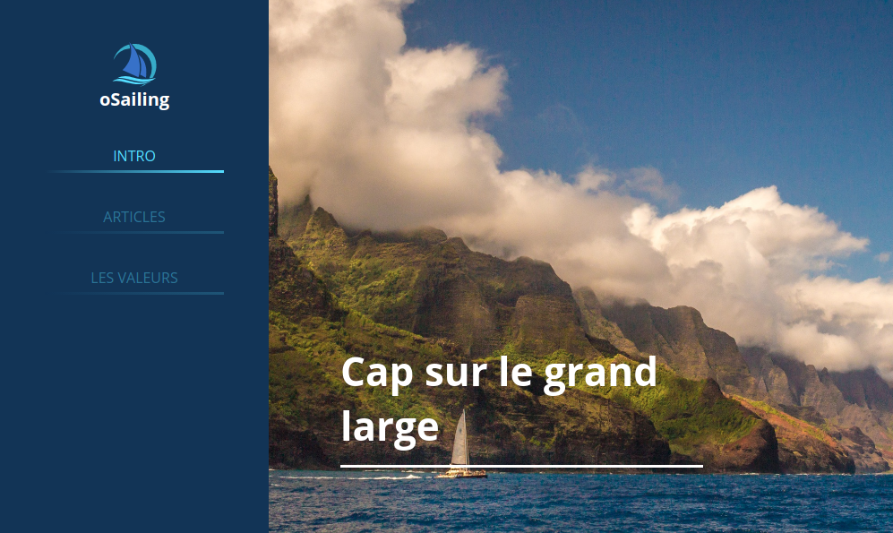

# oSailing

## Objectif

Vous devez réaliser l'intégration de oSailing en utilisant `webpack` et `scss`

Preview : [partie haute](elements/oSailing-haut.png) - [partie basse](elements/oSailing-bas.png)

Le dossier `images/` continent le logo et l'image principale

## Infos

- Font : Open Sans
- jQuery, JS Rellax, jQuery Scrollex
- Couleurs : 
  - Bleu foncé : #123456
  - Bleu vif : #55ddff
  - Bleu contraste : #123789
  - Gris clair: #ccc
  - Gris foncé : #666
